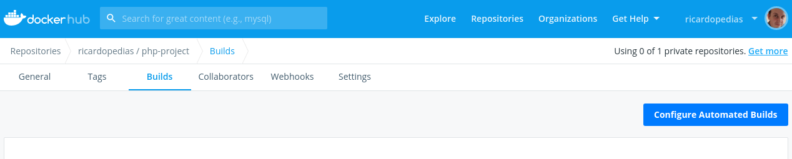
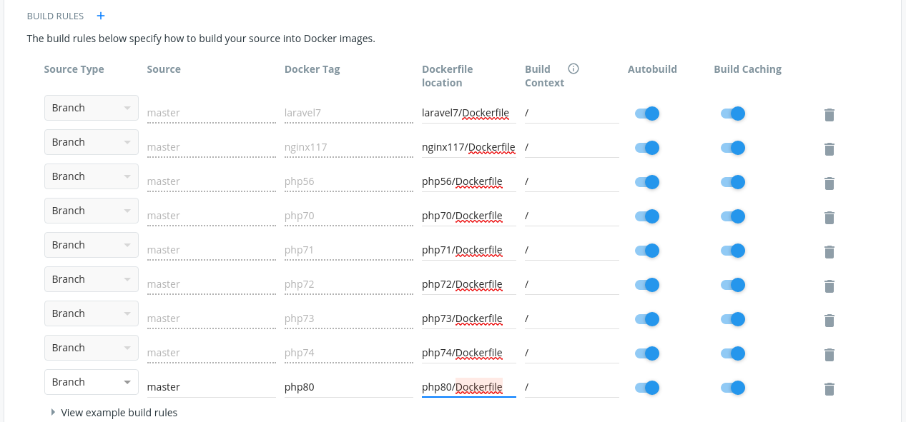

# Automated Builds

As imagens são geradas automaticamente através do serviço "Automated Build" do DockerHub:

Para adicionar uma nova tag, é necessário acrescentar uma nova "Build Rule" apontando para o diretório contendo o "Dockerfile":

A cada push no repositório, o DockerHub agendará um build automaticamente.